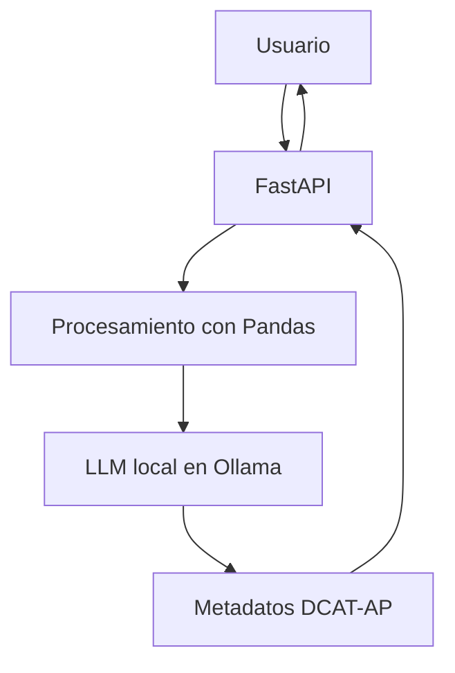

# Generación Automática de Metadatos DCAT/DCAT-AP
**Trabajo de Fin de Grado – Ingeniería de Tecnologías y Servicios de Telecomunicación (UPM)**
**Autora: Aitana Cuadra** 
Este proyecto implementa una **API REST en FastAPI** capaz de analizar archivos JSON o CSV, extraer su estructura e inferir metadatos automáticos siguiendo los estándares **DCAT / DCAT-AP**, utilizando un **modelo de lenguaje local (Ollama)**.

---

## Tecnologías utilizadas

| Tipo | Herramienta |
|------|-------------|
| Lenguaje | Python 3.13 |
| API Framework | FastAPI |
| Procesamiento | Pandas |
| LLM | Ollama (Gemma / Llama) con LangChain |
| Modelado | SQLModel, Pydantic |


---


--- 
## Instalación

### 1. Prerrequisitos

Instalar **Ollama**:  https://ollama.com/download

Descargar el modelo utilizado:

```bash
ollama pull gemma2:2b
```


### 2. Clonar el repositorio
```bash
git clone https://github.com/aitanacuadra/TFG
cd TFG
```

### 3. Crear entorno virtual 
```bash
python -m venv venv
source venv/bin/activate   # Linux / macOS
# venv\Scripts\activate    # Windows
```

### 4. Instalar dependencias
```bash
pip install -r requirements.txt
```

### 5. Configurar variables de entorno

Crear un archivo .env:
```bash
BASE_DATASET_URL=https://example.org/datasets/
OLLAMA_HOST=http://localhost:11434
OLLAMA_MODEL=gemma2:2b
```

### 6. Ejecutar la API
```bash
uvicorn main:app --reload
```
La API estará disponible en: http://localhost:8000

Documentación interactiva:
http://localhost:8000/docs


## Uso de la API
### Endpoint principal
POST /procesar

### Parámetro requerido
archivo .json o .csv


