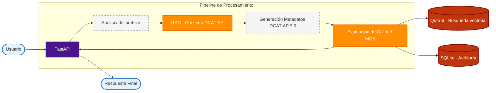

# Automatización de la generación de metadatos DCAT-AP mediante Modelos de Lenguaje de Gran Escala
**Trabajo de Fin de Grado – Ingeniería de Tecnologías y Servicios de Telecomunicación (UPM)**

El presente proyecto desarrolla una solución orientada a la mejora de la gestión y calidad de los metadatos. El objetivo principal consiste en automatizar la generación de metadatos conforme al estándar europeo DCAT-AP, transformando datos brutos en recursos estructurados, localizables y reutilizables. Para ello, se ha desarrollado una arquitectura basada en un sistema RAG que integra FastAPI, LangChain, Ollama y Qdrant. El sistema analiza archivos en formato CSV y JSON para identificar su contenido, generar automáticamente metadatos alineados con el esquema DCAT-AP 3.0 y evaluarlos mediante un LLM-as-a-judge siguiendo la metodología MQA de data.europa.eu.

> **Documentación Completa:** Puedes consultar la guía de instalación y detalles más completos en la [Web de Documentación del Proyecto](https://aitanacuadra.github.io/TFG/).

---


```mermaid
graph LR
    classDef input fill:#E3F2FD,stroke:#1565C0,stroke-width:2px;
    classDef api fill:#4A148C,color:#fff,stroke:#311B92,stroke-width:2px;
    classDef ai fill:#FF8F00,color:#fff,stroke:#EF6C00,stroke-width:2px;
    classDef audit fill:#2E7D32,color:#fff,stroke:#1B5E20,stroke-width:2px;
    classDef store fill:#BF360C,color:#fff,stroke:#870000,stroke-width:2px;
    classDef process fill:#F5F5F5,stroke:#616161,stroke-dasharray: 5 5;

    User([Usuario]) --> API[FastAPI]

    subgraph Pipeline ["Pipeline de Procesamiento"]
        API --> Profiling[Análisis del archivo]
        Profiling --> RAG[RAG · Contexto DCAT-AP]
        RAG --> DCAT[Generación Metadatos DCAT-AP 3.0]
        DCAT --> Judge[Evaluación de Calidad MQA]
    end

    Judge --> Qdrant[(Qdrant · Búsqueda vectorial)]
    Judge --> SQL[(SQLite · Auditoría)]
    Judge --> API
    API --> Output([Respuesta Final])

    class User,Output input;
    class API api;
    class RAG,Judge ai;
    class Qdrant,SQL store;
    class Profiling,DCAT process;
```

---

## Tecnologías utilizadas

| Tipo | Herramienta |
|------|-------------|
| Lenguaje | Python 3.13 |
| API Framework | FastAPI |
| Procesamiento de datos | Pandas |
| Orquestación de IA | LangChain |
| Base de datos vectorial | Qdrant |
| LLM generación de metadatos | Ollama · `gemma3:1b` |
| LLM evaluador (juez) | Google Gemini |
| Base de datos relacional | SQLite (SQLModel) |
| Despliegue | Docker · Docker Compose |

---

## Instalación

### Prerrequisitos

- [Docker Desktop](https://www.docker.com/products/docker-desktop/) instalado y en ejecución.
- [Ollama](https://ollama.com/download) instalado en el host (corre fuera de Docker para aprovechar la GPU).

Descarga los modelos necesarios:

```bash
ollama pull gemma3:1b
ollama pull nomic-embed-text
```

> Son los modelos predeterminados. Puedes usar cualquier otro modelo disponible en [ollama.com/library](https://ollama.com/library) cambiando `OLLAMA_MODEL` y `EMBEDDINGS_MODEL` en tu `.env`.

### 1. Clonar el repositorio

```bash
git clone https://github.com/aitanacuadra/TFG
cd TFG
```

### 2. Configurar variables de entorno

```bash
cp .env.example .env
```

Edita `.env` y sustituye los valores marcados con `<...>`

### 3. Levantar los servicios

```bash
docker compose up --build
```

Esto arranca tres servicios:
- **API** → http://localhost:8000
- **Documentación** (Docusaurus) → http://localhost:3000/TFG/
- **Qdrant** → http://localhost:6333

---

## Uso de la API

La documentación interactiva (Swagger UI) está disponible en http://localhost:8000/docs.

### Endpoint principal

**`POST /api/v1/process`**

Sube un archivo CSV o JSON para generar sus metadatos DCAT-AP 3.0, vectorizarlos en Qdrant y evaluarlos con el modelo juez.

**Autenticación:** cabecera `X-API-Key` con el valor de `API_KEY`.

**Ejemplo con `curl`:**

```bash
curl -X POST http://localhost:8000/api/v1/process \
  -H "X-API-Key: tu-api-key-secreta" \
  -F "file=@dataset.csv"
```

**Respuesta:**

```json
{
  "message": "Procesado y vectorizado con éxito",
  "output_filename": "dataset.csv_meta.json",
  "metadata": {
    "@type": "dcat:Dataset",
    "dct:title": "...",
    "dct:description": "...",
    "dcat:keyword": ["...", "..."],
    ...
  },
  "evaluation": {
    "score_global": 285,
    "categoria_mqa": "Buena (221-350)",
    "analisis_detallado": { ... },
    "mejoras_prioritarias": ["..."]
  }
}
```

---

## Autora

**Aitana Cuadra** — [GitHub](https://github.com/aitanacuadra)
