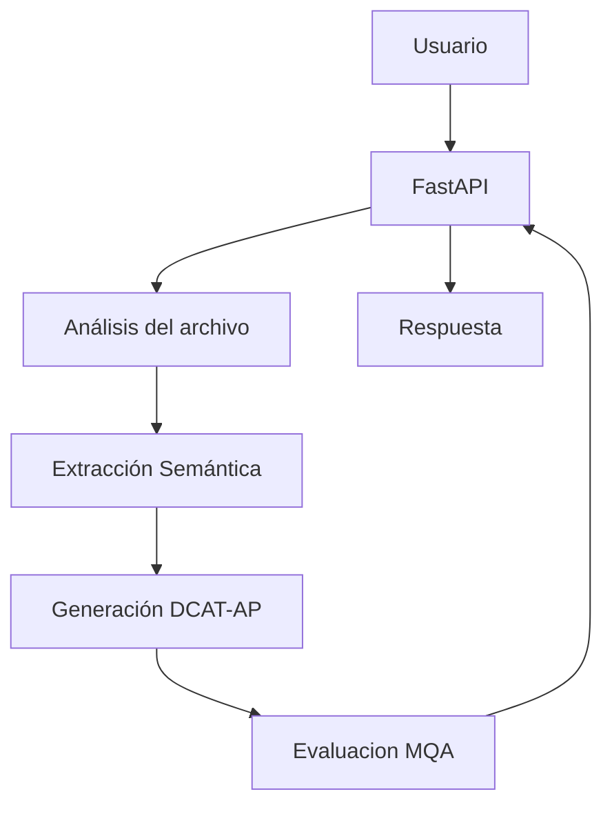

# Automatización de la generación de metadatos DCAT-AP mediante Modelos de Lenguaje de Gran Escala
**Trabajo de Fin de Grado – Ingeniería de Tecnologías y Servicios de Telecomunicación (UPM)**

El presente proyecto desarrolla una solución orientada a la mejora de la gestión y calidad de los metadatos. El objetivo principal consiste en automatizar la generación de metadatos conforme al estándar europeo DCAT-AP, transformando datos brutos en recursos estructurados, localizables y reutilizables. Para ello, se ha desarrollado una arquitectura basada en un sistema RAG que integra FastAPI, LangChain y Ollama. El sistema realiza un análisis de archivos en formato CSV y JSON para identificar su contenido y generar automáticamente metadatos alineados con el esquema DCAT-AP. 


> **Documentación Completa:** Puedes consultar la guía de instalación y detalles mas completos de mi proyecto en la [Web de Documentación del Proyecto](https://aitanacuadra.github.io/TFG/).


---

## Tecnologías utilizadas

| Tipo | Herramienta |
|------|-------------|
| Lenguaje | Python 3.13 |
| API Framework | FastAPI |
| Procesamiento de datos | Pandas |
| Orquestación de IA | LangChain |
| Base de datos vectorial para RAG | FAISS |
| LLM extracción metadatos | Ollama(gemma3:1b) |
| LLM as a judge | gemini-3-flash-preview |


---


```mermaid
graph TD
    User["Usuario"] --> API["FastAPI"]
    API --> Profiling["Análisis del archivo"]
    Profiling --> RAG["Extracción Semántica"]
    RAG --> DCAT["Generación DCAT-AP"]
    DCAT --> Judge["Evaluacion MQA"]
    Judge --> API
    API --> Output["Respuesta"]
```
--- 
## Instalación

### 1. Prerrequisitos

Instalar **Ollama**:  https://ollama.com/download

Descargar el modelo utilizado:

```bash
ollama pull gemma3:1b
```


### 2. Clonar el repositorio
```bash
git clone https://github.com/aitanacuadra/TFG
cd TFG
```

### 3. Crear entorno virtual 
```bash
python -m venv venv
source venv/bin/activate   # Linux / macOS
# venv\Scripts\activate    # Windows
```

### 4. Instalar dependencias
```bash
pip install -r requirements.txt
```

### 5. Configurar variables de entorno

Crear un archivo .env:
```bash
BASE_DATASET_URL=https://example.org/datasets/
OLLAMA_HOST=http://localhost:11434
OLLAMA_MODEL=gemma3:1b

```

### 6. Ejecutar la API
```bash
PYTHONPATH=src uvicorn app.main:app --reload
```
La API estará disponible en: http://localhost:8000


## Uso de la API
### Endpoint principal
POST /procesar

### Parámetro requerido
archivo .json o .csv

# Autora: Aitana Cuadra


