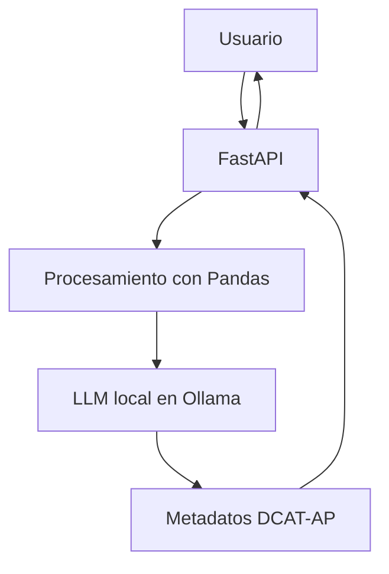

# Generación Automática de Metadatos DCAT/DCAT-AP
**Trabajo de Fin de Grado – Ingeniería de Tecnologías y Servicios de Telecomunicación (UPM)**

Este proyecto implementa una **API REST en FastAPI** capaz de analizar archivos JSON o CSV, extraer su estructura e inferir metadatos automáticos siguiendo los estándares **DCAT / DCAT-AP**, utilizando un **modelo de lenguaje local (Ollama)**.

---

## Tecnologías utilizadas

| Tipo | Herramienta |
|------|-------------|
| Lenguaje | Python 3.13 |
| API Framework | FastAPI |
| Procesamiento | Pandas |
| LLM | Ollama (Gemma) con LangChain |

---

