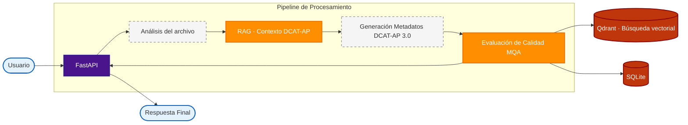

# Diseño e implementación de un sistema de generación automatizada de metadatos DCAT-AP basado en Modelos de Lenguaje de Gran Escala (LLMs).
**Trabajo de Fin de Grado – Ingeniería de Tecnologías y Servicios de Telecomunicación (UPM)**

El presente proyecto desarrolla una solución orientada a la mejora de la gestión y calidad de los metadatos. El objetivo principal consiste en automatizar la generación de metadatos conforme al estándar europeo DCAT-AP, transformando datos brutos en recursos estructurados, localizables y reutilizables. Para ello, se ha desarrollado una arquitectura basada en un sistema RAG que integra FastAPI, LangChain y Ollama. El sistema realiza un análisis de archivos en formato CSV y JSON para identificar su contenido y generar automáticamente metadatos alineados con el esquema DCAT-AP.

---

```mermaid
graph LR
    classDef input fill:#E3F2FD,stroke:#1565C0,stroke-width:2px;
    classDef api fill:#4A148C,color:#fff,stroke:#311B92,stroke-width:2px;
    classDef ai fill:#FF8F00,color:#fff,stroke:#EF6C00,stroke-width:2px;
    classDef audit fill:#2E7D32,color:#fff,stroke:#1B5E20,stroke-width:2px;
    classDef store fill:#BF360C,color:#fff,stroke:#870000,stroke-width:2px;
    classDef process fill:#F5F5F5,stroke:#616161,stroke-dasharray: 5 5;

    User([Usuario]) --> API[FastAPI]

    subgraph Pipeline ["Pipeline de Procesamiento"]
        API --> Profiling[Análisis del archivo]
        Profiling --> RAG[RAG · Contexto DCAT-AP]
        RAG --> DCAT[Generación Metadatos DCAT-AP 3.0]
        DCAT --> Judge[Evaluación de Calidad MQA]
    end

    Judge --> Qdrant[(Qdrant · Búsqueda vectorial)]
    Judge --> SQL[(SQLite)]
    Judge --> API
    API --> Output([Respuesta Final])

    class User,Output input;
    class API api;
    class RAG,Judge ai;
    class Qdrant,SQL store;
    class Profiling,DCAT process;
```

---

## Tecnologías utilizadas

| Tipo | Herramienta |
|------|-------------|
| Lenguaje | Python 3.13 |
| API Framework | FastAPI |
| Procesamiento de datos | Pandas |
| Orquestación de IA | LangChain |
| Base de datos vectorial | Qdrant |
| LLM generación de metadatos | Ollama · `gemma3:1b` |
| LLM evaluador (juez) | Google Gemini |
| Base de datos relacional | SQLite (SQLModel) |
| Despliegue | Docker · Docker Compose |

---

## Fases del pipeline

1. **Análisis del archivo** — Pandas lee el CSV o JSON, detecta codificación y separadores, y genera un perfil estructural con tipos de columnas, valores nulos y ejemplos.
2. **RAG · Contexto DCAT-AP** — Se recuperan fragmentos relevantes de la normativa DCAT-AP 3.0 almacenada en Qdrant para enriquecer el prompt del LLM.
3. **Generación de metadatos** — El LLM local (Ollama) genera un JSON-LD con los campos DCAT-AP: título, descripción, palabras clave, tema y variables medidas.
4. **Evaluación de calidad MQA** — Google Gemini actúa como juez y puntúa los metadatos según las cinco dimensiones de la metodología MQA de data.europa.eu: findability, accessibility, interoperability, reusability y contextuality.
5. **Almacenamiento dual** — Los metadatos se vectorizan y guardan en Qdrant para búsqueda semántica; el registro de auditoría se persiste en SQLite.
