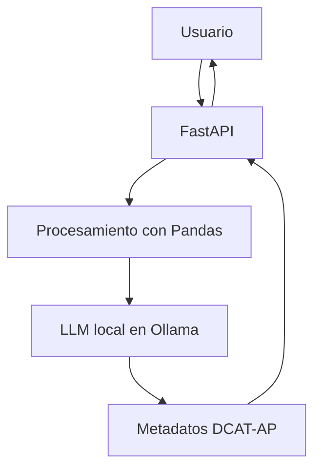

# Automatización de la generación de metadatos DCAT-AP mediante Modelos de Lenguaje de Gran Escala
**Trabajo de Fin de Grado – Ingeniería de Tecnologías y Servicios de Telecomunicación (UPM)**

El presente proyecto desarrolla una solución orientada a la mejora de la gestión y calidad de los metadatos. El objetivo principal consiste en automatizar la generación de metadatos conforme al estándar europeo DCAT-AP, transformando datos brutos en recursos estructurados, localizables y reutilizables. Para ello, se ha desarrollado una arquitectura basada en un sistema RAG que integra FastAPI, LangChain y Ollama. El sistema realiza un análisis de archivos en formato CSV y JSON para identificar su contenido y generar automáticamente metadatos alineados con el esquema DCAT-AP.

---

## Tecnologías utilizadas

| Tipo | Herramienta |
|------|-------------|
| Lenguaje | Python 3.13 |
| API Framework | FastAPI |
| Procesamiento de datos | Pandas |
| Orquestación de IA | LangChain |
| Base de datos vectorial para RAG | FAISS |
| LLM extracción metadatos | Ollama(gemma3:1b) |
| LLM as a judge | gemini-3-flash-preview |

---

```mermaid
graph TD
    Client["Usuario"] --> API["FastAPI"]
    API --> Pre["Procesamiento con Pandas"]
    Pre --> LLM["LLM local en Ollama"]
    LLM --> Meta["Metadatos DCAT-AP"]
    Meta --> API
    API --> Client
```